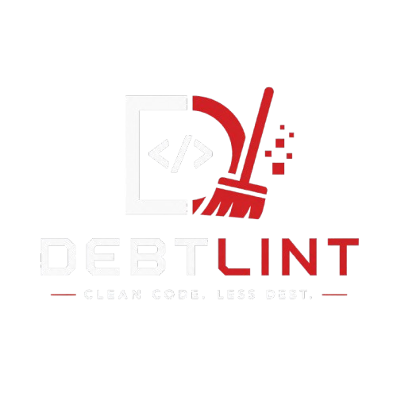

<p align="center">
  
</p>

# Debtlint

**Debtlint** is a technical debt detection tool focused on duplicated logic, built for the era of AI code generation.
It automatically identifies repeated or near-duplicate code segments across a codebase, then provides concrete refactoring guidance.

## Vision

As coding assistants become mainstream, "silent" duplication appears quickly:
- existing utility functions get rewritten,
- business patterns are repeated,
- logic becomes fragmented across multiple files.

Debtlint provides a **programmatic, fast, and cost-efficient** way to prevent this drift and keep architecture healthy over time.

## Objectives

- Detect exact duplications and structural similarities.
- Prioritize technical debt hotspots with a confidence score.
- Provide actionable reports to guide refactoring.
- Integrate easily into team workflows (local, CI, agents).
- Stay as language-agnostic as possible.

## How It Works

The Debtlint pipeline follows four main steps:

1. **Code ingestion**
   Read the target codebase (source files while excluding irrelevant directories).

2. **Sanitization / normalization**
   Clean inputs (comments, surface-level formatting, token normalization) to preserve meaningful logic.

3. **BPE encoding and analysis**
   Use an approach inspired by **Byte Pair Encoding (BPE)** to identify frequent and repetitive patterns.
   The goal is to surface representative segments of recurring code structures at scale.

4. **Scoring and reporting**
   Generate human-readable and machine-readable reports: occurrences, similarity level, potential impact, and refactoring hints.

## Why BPE

BPE is historically a compression and tokenization technique, notably used to segment large amounts of text efficiently.
In Debtlint, this logic helps highlight repetitive structures and grammatical blocks of code.

Core reference: [Byte pair encoding - Wikipedia](https://en.wikipedia.org/wiki/Byte_pair_encoding)

## CLI

Debtlint is designed first as a **CLI**:
- run locally on a codebase,
- simple configuration (includes/excludes, thresholds),
- report output (terminal + CI-friendly formats).

Command example (target spec):

```bash
debtlint scan . --format json --min-score 0.75
```

## GitHub Actions Integration

The project is designed to run automatically in CI pipelines:
- analyze every pull request,
- publish a technical debt report,
- optionally fail the job based on configured thresholds.

Goal: make technical debt visible early, before it spreads into the main branch.

## MCP Integration

Debtlint can be exposed as an MCP tool for AI agents:
- an agent generates code,
- it queries Debtlint after generation,
- it detects existing abstractions or duplicated patterns,
- it updates its proposal to reduce technical debt.

This loop upgrades generation from "best effort" to codebase-aware generation.

## Contributing

Contributions are welcome.
Read the guide: [CONTRIBUTING.md](./CONTRIBUTING.md)

[Project presentation video](https://www.youtube.com/watch?v=-JjcPTZ7Omg&feature=youtu.be)

## Our PoC team ❤️

Developers
| [<br><sub>Enzo Ruffino</sub>](https://github.com/EnzoRuffino) | [<br><sub>Loan Riyanto</sub>](https://github.com/skl1017) | [<br><sub>Eythan EL QUALI</sub>](https://github.com/Staney111) | [<br><sub>Rayan</sub>](https://github.com/Rayan-ouer) |
| :---: | :---: | :---: | :---: |

Manager
| [<br><sub>Laurent Gonzalez</sub>](https://github.com/lg-epitech)
| :---: |

<h2 align=center>
Organization
</h2>

<p align='center'>
    <a href="https://www.linkedin.com/company/pocinnovation/mycompany/">
        
    </a>
    <a href="https://www.instagram.com/pocinnovation/">
        
    </a>
    <a href="https://twitter.com/PoCInnovation">
        
    </a>
    <a href="https://discord.com/invite/Yqq2ADGDS7">
        
    </a>
</p>
<p align=center>
    <a href="https://www.poc-innovation.fr/">
        
    </a>
</p>

> 🚀 Don't hesitate to follow us on our different networks, and put a star 🌟 on `PoC's` repositories

> Made with ❤️ by PoC